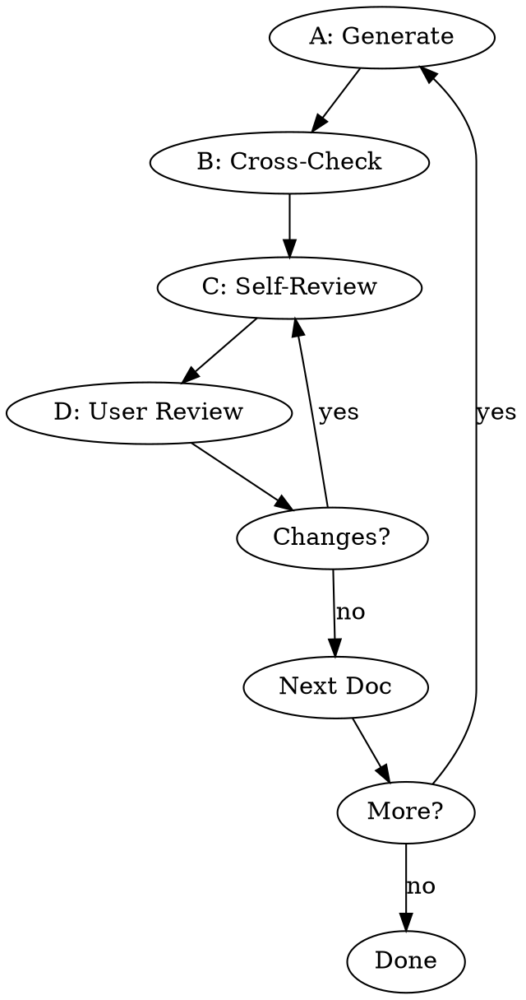

# Pre-Development Documentation

Generate pre-dev docs iteratively: API (Swagger 2.0 YAML) → Database Design.

## Workflow

1. **Understand** - Ask about vision, features, constraints. Skip if entering from brainstorming.
2. **Locate Output Dir** - Scan `openspec/changes/` for the target subdirectory (created externally). If multiple exist, ask user which one to use. This is where all generated docs will be written.
3. **Check Existing** - Check if the target subdirectory already contains docs. Ask: reuse/revise/regenerate?

## Document Generation Loop



**CRITICAL: Complete A→B→C→D for EACH document. No skipping.**

### A: Generate
Read template from `references/template-{doc}.md`, ask gap questions (max 3-5), generate.

### B: Cross-Check
Compare with previous docs. Flag conflicts to user.

### C: Self-Review

**Step 1: Read and scan the document you just generated. Check each item:**

| Check | What to scan for |
|-------|------------------|
| Placeholders | Search for "TBD", "TODO", "[", incomplete sections |
| Consistency | Read through — do any sections contradict each other? |
| Scope | Is this focused enough, or trying to do too much? |
| Ambiguity | Could any requirement be interpreted two ways? |

**Step 2: Fix any issues found. Edit the document inline.**

**Step 3: Output this table to confirm you completed the review:**

```
## 📋 Self-Review: {Doc Name}

| Check | Status | Notes |
|-------|--------|-------|
| Placeholders | ✅/⚠️ | [what you found] |
| Consistency | ✅/⚠️ | [what you found] |
| Scope | ✅/⚠️ | [what you found] |
| Ambiguity | ✅/⚠️ | [what you found] |

[If ⚠️: What you fixed]
```

**The table is proof of review, not the review itself. You must actually scan the document first.**

### D: User Review
Present to user:

> "Spec written to `<path>`. Please review and let me know if you want any changes."

Wait for approval. If changes requested, redo C→D.

## Document Order

| Order | Document | Format | Template |
|-------|----------|--------|----------|
| 1 | API | Swagger 2.0 YAML | `references/template-api.yaml` |
| 2 | Database | Markdown | `references/template-database.md` |

**Always generate API first** — database schema depends on API data models.

## Red Flags — STOP

- **⚠️ No Self-Review table** → CRITICAL violation. Output table NOW.
- **Generating all docs at once** → Must iterate with user feedback.
- **Generating Database before API** → API data models inform schema design.

## Rationalizations

| Excuse | Reality |
|--------|---------|
| "I did review internally" | Internal ≠ visible. Output the table. |
| "It's straightforward" | Simple docs still have issues. Check anyway. |
| "User will catch issues" | Your job is quality, not pushing work to user. |

## Output
```
openspec/changes/<discovered-dir>/API.yaml
openspec/changes/<discovered-dir>/DATABASE.md
```
