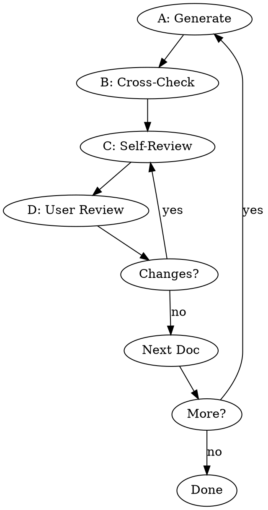

# Pre-Development Documentation

Generate pre-dev docs iteratively: PRD → Architecture → API → Database → Dev Plan (not all required every project).

## Workflow

1. **Understand** - Ask about vision, features, constraints. Skip if entering from brainstorming.
2. **Classify** - Confirm project type, select docs from table below.
3. **Check Existing** - Scan `docs/zeropowers/specs/` for existing docs. Ask: reuse/revise/regenerate?

## Document Generation Loop



**CRITICAL: Complete A→B→C→D for EACH document. No skipping.**

### A: Generate
Read template from `references/template-{doc}.md`, ask gap questions (max 3-5), generate.

### B: Cross-Check
Compare with previous docs. Flag conflicts to user.

### C: Self-Review (MANDATORY OUTPUT)

**You MUST output this table after generating each document:**

```
## 📋 Self-Review: {Doc Name}

| Check | Status | Notes |
|-------|--------|-------|
| Placeholders | ✅/⚠️ | TBD/TODO/incomplete? |
| Consistency | ✅/⚠️ | Contradictions? |
| Scope | ✅/⚠️ | Focused enough? |
| Ambiguity | ✅/⚠️ | Unclear requirements? |

[If ⚠️: List fixes made]
```

**No table = Step C not done. Cannot proceed to D.**

### D: User Review
Present to user:

> "Spec written to `<path>`. Please review and let me know if you want any changes."

Wait for approval. If changes requested, redo C→D.

## Doc Selection by Project Type

| Type | PRD | Arch | API | DB | DevPlan |
|------|-----|------|-----|-----|---------|
| Web/Full-Stack/API/Mobile | ✓ | ✓ | ✓ | ✓ | ✓ |
| CLI | ✓ | ✓ | ✗ | ✗ | ✓ |
| Desktop | ✓ | ✓ | opt | opt | ✓ |

## Red Flags — STOP

- **⚠️ No Self-Review table** → CRITICAL violation. Output table NOW.
- **Generating all docs at once** → Must iterate with user feedback.
- **Skipping PRD** → Architecture needs requirements foundation.

## Rationalizations

| Excuse | Reality |
|--------|---------|
| "I did review internally" | Internal ≠ visible. Output the table. |
| "It's straightforward" | Simple docs still have issues. Check anyway. |
| "User will catch issues" | Your job is quality, not pushing work to user. |

## Templates

| Document | Template | Key Content |
|----------|----------|-------------|
| PRD | `references/template-prd.md` | Vision, users, features, acceptance criteria |
| Architecture | `references/template-architecture.md` | Components, tech stack, security, scaling |
| API | `references/template-api.md` | Endpoints, auth, request/response formats |
| Database | `references/template-database.md` | Schema, relationships, migrations |
| Dev Plan | `references/template-dev-plan.md` | Phases, tasks, dependencies, risks |

## Output
```
docs/zeropowers/specs/{PRD,ARCHITECTURE,API,DATABASE,DEV_PLAN}.md
```
