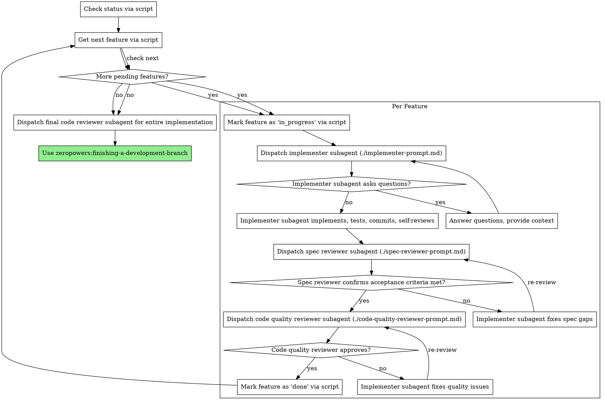

# Subagent-Driven Development

Execute the feature list JSON file by dispatching fresh subagent per feature, with two-stage review after each: spec compliance review first, then code quality review.

**Why subagents:** You delegate features to specialized agents with isolated context. By precisely crafting their instructions and context, you ensure they stay focused and succeed at their task. They should never inherit your session's context or history — you construct exactly what they need. This also preserves your own context for coordination work.

**Core principle:** Fresh subagent per feature + two-stage review (spec then quality) = high quality, fast iteration

**Dependency ordering:** Features in the JSON array are pre-sorted in topological order (dependencies before dependents). Process them in array order. Skip any feature whose dependencies are not yet `done` — come back to it after its dependencies are resolved.

## The Process



## Feature Management Script

**Use `skills/subagent-driven-development/scripts/feature-manager.py` instead of TodoWrite** for persistent, cross-session tracking.

**Why:** TodoWrite is session-scoped and loses state across sessions. The feature list JSON is persistent and serves as the single source of truth.

### Script Commands

```bash
# Check progress
python3 skills/subagent-driven-development/scripts/feature-manager.py status openspec/changes/<dir>/plan.json

# Get next feature to work on (respects dependencies)
python3 skills/subagent-driven-development/scripts/feature-manager.py next openspec/changes/<dir>/plan.json

# Start a feature
python3 skills/subagent-driven-development/scripts/feature-manager.py start openspec/changes/<dir>/plan.json <feature-id>

# Complete a feature
python3 skills/subagent-driven-development/scripts/feature-manager.py complete openspec/changes/<dir>/plan.json <feature-id>

# List blocked features
python3 skills/subagent-driven-development/scripts/feature-manager.py blocked openspec/changes/<dir>/plan.json
```

## Document Loading Strategy

**Hybrid approach: mandatory docs + lazy-loaded specs.**

### Mandatory Documents

Every subagent MUST read these two files before starting work:
- `openspec/changes/<dir>/design.md` — system design and architecture
- `openspec/changes/<dir>/proposal.md` — product requirements and proposal

**Why mandatory:** These define the "why" and overall architecture. Without them, subagents risk contradicting the design or missing product intent.

### Lazy-Loaded Specs (loaded by subagents as needed)

Controller provides:
- Feature data (description, acceptance_criteria, files)
- Spec references (paths like `openspec/changes/<dir>/API.yaml#POST /auth/login`)
- Context about dependencies and conventions

Subagents decide:
- Whether they need to read specs (acceptance criteria unclear, architectural questions)
- Which sections to read (only what's relevant)
- When to read (before implementation, or when stuck)

**Controller's job:** Tell subagents the mandatory file paths and the spec reference paths. Subagents read mandatory docs first, then lazy-load other specs as needed.

## Handling Implementer Status

Implementer subagents report one of four statuses. Handle each appropriately:

**DONE:** Proceed to spec compliance review.

**DONE_WITH_CONCERNS:** The implementer completed the work but flagged doubts. Read the concerns before proceeding. If the concerns are about correctness or scope, address them before review. If they're observations (e.g., "this file is getting large"), note them and proceed to review.

**NEEDS_CONTEXT:** The implementer needs information that wasn't provided. Provide the missing context and re-dispatch.

**BLOCKED:** The implementer cannot complete the feature. Assess the blocker:
1. If it's a context problem, provide more context and re-dispatch with the same model
2. If the feature requires more reasoning, re-dispatch with a more capable model
3. If the feature is too large, break it into smaller pieces
4. If the plan itself is wrong, escalate to the human

**Never** ignore an escalation or force the same model to retry without changes. If the implementer said it's stuck, something needs to change.

## Prompt Templates

- `./implementer-prompt.md` - Dispatch implementer subagent
- `./spec-reviewer-prompt.md` - Dispatch spec compliance reviewer subagent
- `./code-quality-reviewer-prompt.md` - Dispatch code quality reviewer subagent

### Implementer Dispatch Checklist

When dispatching an implementer subagent, you MUST include ALL of the following sections in the prompt. No section is optional. No section may be omitted regardless of perceived simplicity:

| # | Section | Source | Required |
|---|---------|--------|----------|
| 1 | Feature Description | `feature.description` | ALWAYS |
| 2 | Acceptance Criteria | `feature.acceptance_criteria` | ALWAYS |
| 3 | Files | `feature.files` | ALWAYS |
| 4 | Context (scene-setting) | Your knowledge of project | ALWAYS |
| 5 | Mandatory Documents | design.md + proposal.md paths | ALWAYS |
| 6 | Spec References | `feature.spec_refs` (if non-empty) | ALWAYS when present |
| 7 | TDD Instruction | Explicit instruction to invoke skill | ALWAYS |
| 8 | Before You Begin | Ask questions first | ALWAYS |
| 9 | Code Organization | File responsibility guidelines | ALWAYS |
| 10 | Self-Review | Completeness/quality/discipline check | ALWAYS |
| 11 | Report Format | Status + changes + findings | ALWAYS |

**Common violations to avoid:**
- Omitting Spec References because "the acceptance criteria are clear enough" — include them anyway
- Omitting TDD Instruction because "this feature is trivial" — TDD is ALWAYS mandatory, no exceptions
- Omitting Mandatory Documents because "the subagent can figure it out" — it cannot
- Condensing multiple sections into a short paragraph — use the full template structure

### Review Dispatch Rules

Every feature goes through exactly TWO review subagents. No shortcuts. No combining. No skipping.

```
Implementer completes feature
        │
        ▼
┌─────────────────────────┐
│ 1. Spec Compliance      │  MUST dispatch via ./spec-reviewer-prompt.md
│    Review Subagent      │  Controller CANNOT do this itself
└────────┬────────────────┘
         │ (pass only)
         ▼
┌─────────────────────────┐
│ 2. Code Quality         │  MUST dispatch via ./code-quality-reviewer-prompt.md
│    Review Subagent      │  Controller CANNOT do this itself
└────────┬────────────────┘
         │ (pass only)
         ▼
    Mark feature as done
```

**Each review is a separate subagent dispatch.** This means exactly 3 subagent dispatches per feature: 1 implementer + 1 spec reviewer + 1 code quality reviewer.

**The controller MUST NOT:**
- Review the implementer's work itself by reading the changed files and forming an opinion
- Skip spec review because "the feature looks straightforward"
- Skip code quality review because "spec review already passed" — these check different things
- Skip code quality review because "the implementer did a good self-review" — self-review is not a substitute
- Combine spec review and code quality review into one subagent dispatch
- Proceed to the next feature without both reviews passing
- Decide a feature is "too simple" to need both reviews — every feature gets both, always

**Review order is fixed:** Spec compliance first → Code quality second. Never reverse or skip.

## Example Workflow

```
You: I'm using Subagent-Driven Development to execute this plan.

$ python3 skills/subagent-driven-development/scripts/feature-manager.py status openspec/changes/auth/plan.json
Feature List Status:
  Total: 5
  ✅ Done: 0
  🔄 In Progress: 0
  ⏳ Pending: 5
  🚫 Blocked: 0

$ python3 skills/subagent-driven-development/scripts/feature-manager.py next openspec/changes/auth/plan.json
Next feature: auth-001
  Category: authentication
  Function: user-login
  Description: Implement email/password login

Feature auth-001: User login

$ python3 skills/subagent-driven-development/scripts/feature-manager.py start openspec/changes/auth/plan.json auth-001
[Dispatch implementation subagent with feature data + context]

Implementer: "Before I begin - should tokens expire after 1 hour or 24 hours?"

You: "1 hour, with refresh token support in a later feature"

Implementer: "Got it. Implementing now..."
[Later] Implementer:
  - Implemented login endpoint
  - Added tests, 5/5 passing
  - Self-review: Found I missed brute-force rate limiting, added it
  - Committed

[Dispatch spec compliance reviewer with acceptance_criteria]
Spec reviewer: ✅ All 3 acceptance criteria met, nothing extra

[Get git SHAs, dispatch code quality reviewer]
Code reviewer: Strengths: Good test coverage, clean. Issues: None. Approved.

$ python3 skills/subagent-driven-development/scripts/feature-manager.py complete openspec/changes/auth/plan.json auth-001

$ python3 skills/subagent-driven-development/scripts/feature-manager.py next openspec/changes/auth/plan.json
Next feature: auth-002
  Category: authentication
  Function: token-refresh
  Description: Implement token refresh endpoint

Feature auth-002: Token refresh

$ python3 skills/subagent-driven-development/scripts/feature-manager.py start openspec/changes/auth/plan.json auth-002
[Dispatch implementation subagent with feature data + context]

Implementer: [No questions, proceeds]
Implementer:
  - Added refresh token endpoint
  - 8/8 tests passing
  - Self-review: All good
  - Committed

[Dispatch spec compliance reviewer]
Spec reviewer: ❌ Issues:
  - Missing: Token rotation (acceptance criteria says "old refresh token must be invalidated")
  - Extra: Added token family tracking (not requested)

[Implementer fixes issues]
Implementer: Removed token family tracking, added proper token invalidation

[Spec reviewer reviews again]
Spec reviewer: ✅ All acceptance criteria met now

[Dispatch code quality reviewer]
Code reviewer: Strengths: Solid. Issues (Important): Magic number (3600 for TTL)

[Implementer fixes]
Implementer: Extracted TOKEN_TTL_SECONDS constant

[Code reviewer reviews again]
Code reviewer: ✅ Approved

$ python3 skills/subagent-driven-development/scripts/feature-manager.py complete openspec/changes/auth/plan.json auth-002

...

[After all features]
$ python3 skills/subagent-driven-development/scripts/feature-manager.py status openspec/changes/auth/plan.json
Feature List Status:
  Total: 5
  ✅ Done: 5
  Progress: 100.0%

[Dispatch final code-reviewer]
Final reviewer: All requirements met, ready to merge

Done!
```

## Red Flags

**Never:**
- Start implementation on main/master branch without explicit user consent
- Review the implementer's work yourself instead of dispatching review subagents
- Skip spec compliance review OR code quality review — both are mandatory, both require separate subagent dispatches
- Proceed with unfixed issues
- Dispatch multiple implementation subagents in parallel (conflicts)
- Make subagent read feature list JSON file (provide feature data instead)
- Skip scene-setting context (subagent needs to understand where feature fits)
- Ignore subagent questions (answer before letting them proceed)
- Accept "close enough" on spec compliance (spec reviewer found issues = not done)
- Skip review loops (reviewer found issues = implementer fixes = review again)
- Let implementer self-review replace actual review (both are needed)
- **Start code quality review before spec compliance is ✅** (wrong order)
- Move to next feature while either review has open issues
- Forget to update feature status in JSON after completion
- **Omit any section from the implementer dispatch prompt** (use the checklist)
- **Decide TDD is not needed for a feature** — TDD is always mandatory, no exceptions
- **Skip Spec References in implementer prompt** because "it's simple enough"

**If subagent asks questions:**
- Answer clearly and completely
- Provide additional context if needed
- Don't rush them into implementation

**If reviewer finds issues:**
- Implementer (same subagent) fixes them
- Reviewer reviews again
- Repeat until approved
- Don't skip the re-review

**If subagent fails feature:**
- Dispatch fix subagent with specific instructions
- Don't try to fix manually (context pollution)

## Integration

**Required workflow skills:**
- **zeropowers:writing-plans** - Creates the feature list JSON this skill executes
- **zeropowers:requesting-code-review** - Code review template for reviewer subagents
- **zeropowers:finishing-a-development-branch** - Complete development after all features

**Subagents should use:**
- **zeropowers:test-driven-development** - Subagents follow TDD for each feature
- **zeropowers:integration-testing** - Integration and E2E tests after unit tests pass

**Alternative workflow:**
- **zeropowers:executing-plans** - Use for parallel session instead of same-session execution
