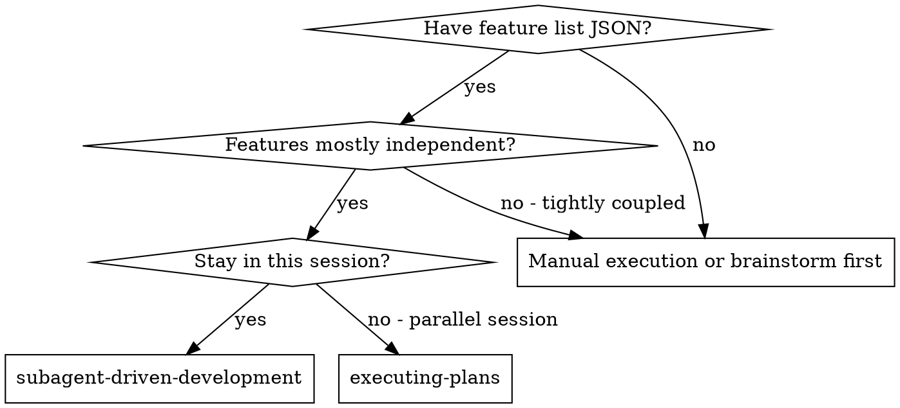
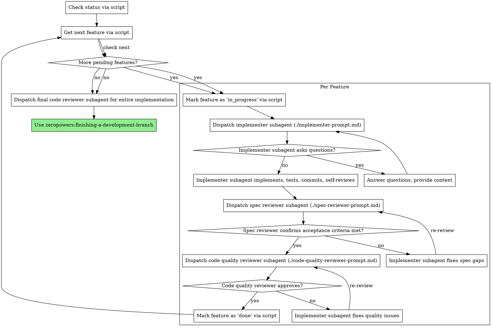

# Subagent-Driven Development

Execute the feature list JSON file by dispatching fresh subagent per feature, with two-stage review after each: spec compliance review first, then code quality review.

**Why subagents:** You delegate features to specialized agents with isolated context. By precisely crafting their instructions and context, you ensure they stay focused and succeed at their task. They should never inherit your session's context or history — you construct exactly what they need. This also preserves your own context for coordination work.

**Core principle:** Fresh subagent per feature + two-stage review (spec then quality) = high quality, fast iteration

**Dependency ordering:** Features in the JSON array are pre-sorted in topological order (dependencies before dependents). Process them in array order. Skip any feature whose dependencies are not yet `done` — come back to it after its dependencies are resolved.

## When to Use



**vs. Executing Plans (parallel session):**
- Same session (no context switch)
- Fresh subagent per feature (no context pollution)
- Two-stage review after each feature: spec compliance first, then code quality
- Faster iteration (no human-in-loop between features)

## The Process



## Feature Management Script

**Use `skills/subagent-driven-development/scripts/feature-manager.py` instead of TodoWrite** for persistent, cross-session tracking.

**Why:** TodoWrite is session-scoped and loses state across sessions. The feature list JSON is persistent and serves as the single source of truth.

### Script Commands

```bash
# Check progress
python3 skills/subagent-driven-development/scripts/feature-manager.py status docs/zeropowers/plans/<plan>.json

# Get next feature to work on (respects dependencies)
python3 skills/subagent-driven-development/scripts/feature-manager.py next docs/zeropowers/plans/<plan>.json

# Start a feature
python3 skills/subagent-driven-development/scripts/feature-manager.py start docs/zeropowers/plans/<plan>.json <feature-id>

# Complete a feature
python3 skills/subagent-driven-development/scripts/feature-manager.py complete docs/zeropowers/plans/<plan>.json <feature-id>

# List blocked features
python3 skills/subagent-driven-development/scripts/feature-manager.py blocked docs/zeropowers/plans/<plan>.json
```

### Controller Workflow

1. **Start of session:**
   ```bash
   python3 skills/subagent-driven-development/scripts/feature-manager.py status docs/zeropowers/plans/auth.json
   ```

2. **Get next feature:**
   ```bash
   python3 skills/subagent-driven-development/scripts/feature-manager.py next docs/zeropowers/plans/auth.json
   # Returns: Feature with all dependencies met, in topological order
   ```

3. **Start feature:**
   ```bash
   python3 skills/subagent-driven-development/scripts/feature-manager.py start docs/zeropowers/plans/auth.json auth-002
   # Updates JSON: status → "in_progress"
   ```

4. **Complete feature:**
   ```bash
   python3 skills/subagent-driven-development/scripts/feature-manager.py complete docs/zeropowers/plans/auth.json auth-002
   # Updates JSON: status → "done"
   ```

## Lazy Loading Strategy

**Specs are lazy-loaded by subagents, not pre-loaded by controller.**

Controller provides:
- Feature data (description, acceptance_criteria, files)
- Spec references (paths like `docs/zeropowers/specs/PRD.md#2.1`)
- Context about dependencies and conventions

Subagents decide:
- Whether they need to read specs (acceptance criteria unclear, architectural questions)
- Which sections to read (only what's relevant)
- When to read (before implementation, or when stuck)

**Why lazy loading:**
- Saves tokens: Most features don't need full spec context
- Faster dispatch: Controller doesn't wait for spec reads
- Subagent autonomy: They read what they need, when they need it
- Avoids overloading: Implementers focus on feature, not entire system

**Controller's job:** Provide the map (spec paths), not the territory (spec content).

## Model Selection

Use the least powerful model that can handle each role to conserve cost and increase speed.

**Mechanical implementation features** (isolated functions, clear acceptance criteria, 1-2 files): use a fast, cheap model. Most implementation features are mechanical when the criteria are well-specified.

**Integration and judgment features** (multi-file coordination, pattern matching, debugging): use a standard model.

**Architecture, design, and review features**: use the most capable available model.

**Feature complexity signals:**
- Touches 1-2 files with complete acceptance criteria → cheap model
- Touches multiple files with integration concerns → standard model
- Requires design judgment or broad codebase understanding → most capable model

## Handling Implementer Status

Implementer subagents report one of four statuses. Handle each appropriately:

**DONE:** Proceed to spec compliance review.

**DONE_WITH_CONCERNS:** The implementer completed the work but flagged doubts. Read the concerns before proceeding. If the concerns are about correctness or scope, address them before review. If they're observations (e.g., "this file is getting large"), note them and proceed to review.

**NEEDS_CONTEXT:** The implementer needs information that wasn't provided. Provide the missing context and re-dispatch.

**BLOCKED:** The implementer cannot complete the feature. Assess the blocker:
1. If it's a context problem, provide more context and re-dispatch with the same model
2. If the feature requires more reasoning, re-dispatch with a more capable model
3. If the feature is too large, break it into smaller pieces
4. If the plan itself is wrong, escalate to the human

**Never** ignore an escalation or force the same model to retry without changes. If the implementer said it's stuck, something needs to change.

## Prompt Templates

- `./implementer-prompt.md` - Dispatch implementer subagent
- `./spec-reviewer-prompt.md` - Dispatch spec compliance reviewer subagent
- `./code-quality-reviewer-prompt.md` - Dispatch code quality reviewer subagent

## Example Workflow

```
You: I'm using Subagent-Driven Development to execute this plan.

$ python3 skills/subagent-driven-development/scripts/feature-manager.py status docs/zeropowers/plans/2026-04-03-auth.json
Feature List Status:
  Total: 5
  ✅ Done: 0
  🔄 In Progress: 0
  ⏳ Pending: 5
  🚫 Blocked: 0

$ python3 skills/subagent-driven-development/scripts/feature-manager.py next docs/zeropowers/plans/2026-04-03-auth.json
Next feature: auth-001
  Category: authentication
  Function: user-login
  Description: Implement email/password login

Feature auth-001: User login

$ python3 skills/subagent-driven-development/scripts/feature-manager.py start docs/zeropowers/plans/2026-04-03-auth.json auth-001
[Dispatch implementation subagent with feature data + context]

Implementer: "Before I begin - should tokens expire after 1 hour or 24 hours?"

You: "1 hour, with refresh token support in a later feature"

Implementer: "Got it. Implementing now..."
[Later] Implementer:
  - Implemented login endpoint
  - Added tests, 5/5 passing
  - Self-review: Found I missed brute-force rate limiting, added it
  - Committed

[Dispatch spec compliance reviewer with acceptance_criteria]
Spec reviewer: ✅ All 3 acceptance criteria met, nothing extra

[Get git SHAs, dispatch code quality reviewer]
Code reviewer: Strengths: Good test coverage, clean. Issues: None. Approved.

$ python3 skills/subagent-driven-development/scripts/feature-manager.py complete docs/zeropowers/plans/2026-04-03-auth.json auth-001

$ python3 skills/subagent-driven-development/scripts/feature-manager.py next docs/zeropowers/plans/2026-04-03-auth.json
Next feature: auth-002
  Category: authentication
  Function: token-refresh
  Description: Implement token refresh endpoint

Feature auth-002: Token refresh

$ python3 skills/subagent-driven-development/scripts/feature-manager.py start docs/zeropowers/plans/2026-04-03-auth.json auth-002
[Dispatch implementation subagent with feature data + context]

Implementer: [No questions, proceeds]
Implementer:
  - Added refresh token endpoint
  - 8/8 tests passing
  - Self-review: All good
  - Committed

[Dispatch spec compliance reviewer]
Spec reviewer: ❌ Issues:
  - Missing: Token rotation (acceptance criteria says "old refresh token must be invalidated")
  - Extra: Added token family tracking (not requested)

[Implementer fixes issues]
Implementer: Removed token family tracking, added proper token invalidation

[Spec reviewer reviews again]
Spec reviewer: ✅ All acceptance criteria met now

[Dispatch code quality reviewer]
Code reviewer: Strengths: Solid. Issues (Important): Magic number (3600 for TTL)

[Implementer fixes]
Implementer: Extracted TOKEN_TTL_SECONDS constant

[Code reviewer reviews again]
Code reviewer: ✅ Approved

$ python3 skills/subagent-driven-development/scripts/feature-manager.py complete docs/zeropowers/plans/2026-04-03-auth.json auth-002

...

[After all features]
$ python3 skills/subagent-driven-development/scripts/feature-manager.py status docs/zeropowers/plans/2026-04-03-auth.json
Feature List Status:
  Total: 5
  ✅ Done: 5
  Progress: 100.0%

[Dispatch final code-reviewer]
Final reviewer: All requirements met, ready to merge

Done!
```

## Advantages

**vs. Manual execution:**
- Subagents follow TDD naturally
- Fresh context per feature (no confusion)
- Parallel-safe (subagents don't interfere)
- Subagent can ask questions (before AND during work)

**vs. Executing Plans:**
- Same session (no handoff)
- Continuous progress (no waiting)
- Review checkpoints automatic

**Efficiency gains:**
- No file reading overhead (controller provides feature data)
- Controller curates exactly what context is needed
- Subagent gets complete information upfront
- Questions surfaced before work begins (not after)
- JSON status persists across sessions — interrupted work resumes cleanly

**Quality gates:**
- Self-review catches issues before handoff
- Two-stage review: spec compliance, then code quality
- Review loops ensure fixes actually work
- Acceptance criteria prevent over/under-building
- Code quality ensures implementation is well-built

**TDD Verification (Three-Layer):**

1. **Spec Compliance Reviewer** - Verify tests exist for each acceptance criterion
   - Maps each criterion to at least one test
   - Checks test quality (behavior vs implementation)
   - Flags untested edge cases

2. **Code Quality Reviewer** - Run coverage analysis
   - Executes coverage tool (npm test --coverage, pytest --cov, etc.)
   - Enforces 80% minimum coverage for new code
   - Identifies uncovered lines in changed files
   - Verifies tests actually verify behavior (not just hit lines)

3. **Coverage Evidence** - Require proof before approval
   - Spec reviewer confirms: "Each criterion has test coverage"
   - Code reviewer confirms: "Coverage ≥ 80%, uncovered lines identified"
   - Both must pass before feature marked done

**TDD Verification (Three-Layer):**

1. **Spec Compliance Reviewer** - Verify tests exist for each acceptance criterion
   - Maps each criterion to at least one test
   - Checks test quality (behavior vs implementation)
   - Flags untested edge cases

2. **Code Quality Reviewer** - Run coverage analysis
   - Executes coverage tool (npm test --coverage, pytest --cov, etc.)
   - Enforces 80% minimum coverage for new code
   - Identifies uncovered lines in changed files
   - Verifies tests actually verify behavior (not just hit lines)

3. **Coverage Evidence** - Require proof before approval
   - Spec reviewer confirms: "Each criterion has test coverage"
   - Code reviewer confirms: "Coverage ≥ 80%, uncovered lines identified"
   - Both must pass before feature marked done

**Cost:**
- More subagent invocations (implementer + 2 reviewers per feature)
- Controller does more prep work (extracting all features upfront)
- Review loops add iterations
- But catches issues early (cheaper than debugging later)

## Red Flags

**Never:**
- Start implementation on main/master branch without explicit user consent
- Skip reviews (spec compliance OR code quality)
- Proceed with unfixed issues
- Dispatch multiple implementation subagents in parallel (conflicts)
- Make subagent read feature list JSON file (provide feature data instead)
- Skip scene-setting context (subagent needs to understand where feature fits)
- Ignore subagent questions (answer before letting them proceed)
- Accept "close enough" on spec compliance (spec reviewer found issues = not done)
- Skip review loops (reviewer found issues = implementer fixes = review again)
- Let implementer self-review replace actual review (both are needed)
- **Start code quality review before spec compliance is ✅** (wrong order)
- Move to next feature while either review has open issues
- Forget to update feature status in JSON after completion

**If subagent asks questions:**
- Answer clearly and completely
- Provide additional context if needed
- Don't rush them into implementation

**If reviewer finds issues:**
- Implementer (same subagent) fixes them
- Reviewer reviews again
- Repeat until approved
- Don't skip the re-review

**If subagent fails feature:**
- Dispatch fix subagent with specific instructions
- Don't try to fix manually (context pollution)

## Integration

**Required workflow skills:**
- **zeropowers:writing-plans** - Creates the feature list JSON this skill executes
- **zeropowers:requesting-code-review** - Code review template for reviewer subagents
- **zeropowers:finishing-a-development-branch** - Complete development after all features

**Subagents should use:**
- **zeropowers:test-driven-development** - Subagents follow TDD for each feature
- **zeropowers:integration-testing** - Integration and E2E tests after unit tests pass

**Alternative workflow:**
- **zeropowers:executing-plans** - Use for parallel session instead of same-session execution
