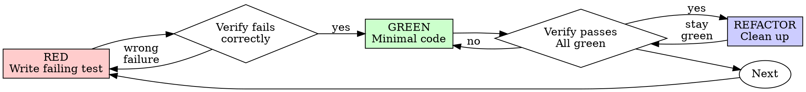
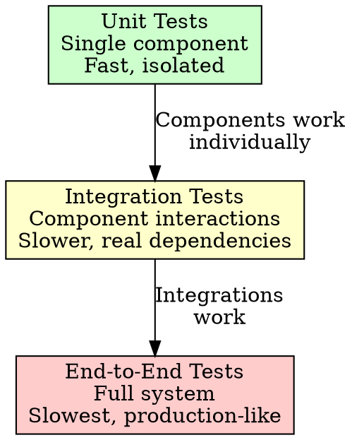
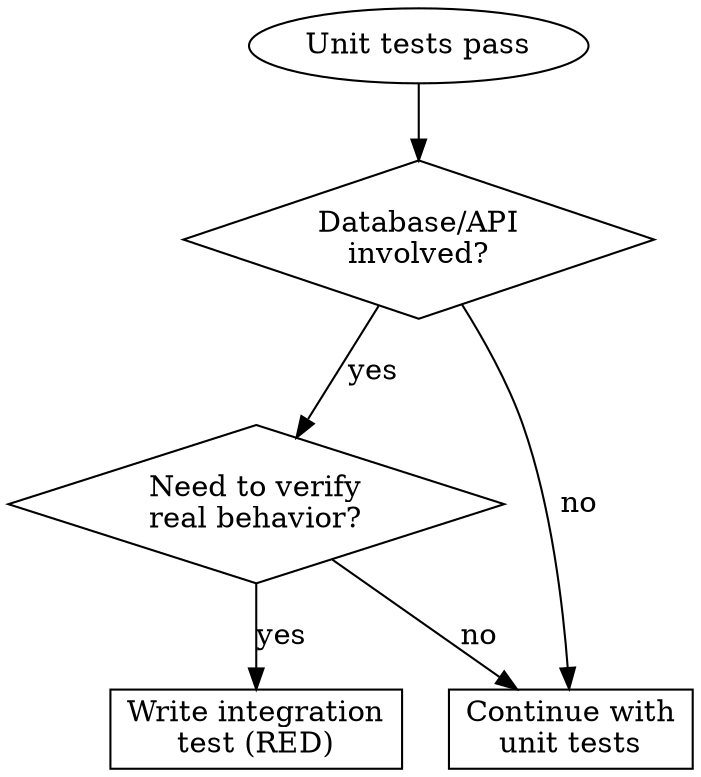

# Test-Driven Development (TDD)

## Overview

Write the test first. Watch it fail. Write minimal code to pass.

**Core principle:** If you didn't watch the test fail, you don't know if it tests the right thing.

**Violating the letter of the rules is violating the spirit of the rules.**

## When to Use

**Always:**
- New features
- Bug fixes
- Refactoring
- Behavior changes

**Exceptions (ask your human partner):**
- Throwaway prototypes
- Generated code
- Configuration files

Thinking "skip TDD just this once"? Stop. That's rationalization.

## The Iron Law

```
NO PRODUCTION CODE WITHOUT A FAILING TEST FIRST
```

Write code before the test? Delete it. Start over.

**No exceptions:**
- Don't keep it as "reference"
- Don't "adapt" it while writing tests
- Don't look at it
- Delete means delete

Implement fresh from tests. Period.

## Red-Green-Refactor



### RED - Write Failing Test

Write one minimal test showing what should happen.

<Good>
```java
@Test
void retriesFailedOperationsThreeTimes() throws Exception {
    AtomicInteger attempts = new AtomicInteger(0);

    Callable<String> operation = () -> {
        int attempt = attempts.incrementAndGet();
        if (attempt < 3) {
            throw new RuntimeException("Operation failed");
        }
        return "success";
    };

    String result = retryService.retry(operation);

    assertThat(result).isEqualTo("success");
    assertThat(attempts.get()).isEqualTo(3);
}
```
Clear name, tests real behavior, one thing
</Good>

<Bad>
```java
@Test
void retryWorks() throws Exception {
    Callable<String> mock = mock(Callable.class);
    when(mock.call())
        .thenThrow(new RuntimeException())
        .thenThrow(new RuntimeException())
        .thenReturn("success");

    retryService.retry(mock);

    verify(mock, times(3)).call();
}
```
Vague name, tests mock not code
</Bad>

**Requirements:**
- One behavior
- Clear name
- Real code (no mocks unless unavoidable)

### Verify RED - Watch It Fail

**MANDATORY. Never skip.**

```bash
mvn test -Dtest=RetryServiceTest#retriesFailedOperationsThreeTimes
# or: gradle test --tests RetryServiceTest.retriesFailedOperationsThreeTimes
```

Confirm:
- Test fails (not errors)
- Failure message is expected
- Fails because feature missing (not typos)

**Test passes?** You're testing existing behavior. Fix test.

**Test errors?** Fix error, re-run until it fails correctly.

### GREEN - Minimal Code

Write simplest code to pass the test.

<Good>
```java
@Service
public class RetryService {

    public <T> T retry(Callable<T> operation) throws Exception {
        Exception lastException = null;

        for (int i = 0; i < 3; i++) {
            try {
                return operation.call();
            } catch (Exception e) {
                lastException = e;
            }
        }

        throw lastException;
    }
}
```
Just enough to pass
</Good>

<Bad>
```java
@Service
public class RetryService {

    private int maxRetries = 3;
    private BackoffStrategy backoffStrategy = BackoffStrategy.FIXED;
    private Duration initialDelay = Duration.ofMillis(100);

    public <T> T retry(Callable<T> operation) throws Exception {
        return retry(operation, RetryOptions.builder()
            .maxRetries(maxRetries)
            .backoffStrategy(backoffStrategy)
            .initialDelay(initialDelay)
            .build());
    }

    public <T> T retry(Callable<T> operation, RetryOptions options) throws Exception {
        // YAGNI - You Ain't Gonna Need It
        return null;
    }
}
```
Over-engineered
</Bad>

Don't add features, refactor other code, or "improve" beyond the test.

### Verify GREEN - Watch It Pass

**MANDATORY.**

```bash
mvn test -Dtest=RetryServiceTest#retriesFailedOperationsThreeTimes
# or: gradle test --tests RetryServiceTest.retriesFailedOperationsThreeTimes
```

Confirm:
- Test passes
- Other tests still pass
- Output pristine (no errors, warnings)

**Test fails?** Fix code, not test.

**Other tests fail?** Fix now.

### REFACTOR - Clean Up

After green only:
- Remove duplication
- Improve names
- Extract helpers

Keep tests green. Don't add behavior.

### Repeat

Next failing test for next feature.

## Test Levels

TDD applies to **all test levels**, not just unit tests.



**Same RED-GREEN-REFACTOR cycle. Different scope.**

| Level | Scope | Speed | When to Use |
|-------|-------|-------|-------------|
| **Unit** | Single component | Fast (ms) | Pure logic, calculations |
| **Integration** | Component interactions | Medium (s) | Database, API, messaging |
| **End-to-End** | Full system | Slow (min) | Critical user journeys |

## Integration Test TDD

Integration tests follow the **same RED-GREEN-REFACTOR cycle**. Different scope, same discipline.

### When to Write Integration Tests



Write integration tests when:
- Components interact with databases, message queues, external APIs
- Unit tests with mocks don't prove real behavior
- Configuration, connection strings, serialization matter


### Integration Test Examples

<Good>
```java
@SpringBootTest
@Testcontainers
class UserMapperIntegrationTest {

    @Container
    @ServiceConnection
    static PostgreSQLContainer<?> postgres = new PostgreSQLContainer<>("postgres:16");

    @Autowired
    private UserMapper userMapper;

    @Test
    void insertsAndFindsUser() {
        User user = new User("alice@example.com", "Alice");

        userMapper.insert(user);  // Not implemented yet

        User found = userMapper.findByEmail("alice@example.com");
        assertThat(found.getName()).isEqualTo("Alice");
    }
}
```
@SpringBootTest loads real MyBatis context, @Testcontainers provides real PostgreSQL, @ServiceConnection auto-configures datasource
</Good>

<Bad>
```java
@Test
void userMapperWorks() {
    UserMapper mockMapper = mock(UserMapper.class);
    when(mockMapper.findByEmail(any())).thenReturn(new User());

    UserService service = new UserService(mockMapper);
    service.createUser("test@example.com");

    verify(mockMapper).insert(any());  // Testing mock behavior
}
```
This is a unit test, not integration. Mocking defeats the purpose.
</Bad>

### Integration Test Anti-Patterns

| Anti-Pattern | Problem | Fix |
|--------------|---------|-----|
| Mocking in integration test | Tests mock, not real behavior | Use real DB/containers |
| Integration test for pure logic | Slow, unnecessary | Use unit test |
| Shared state between tests | Tests affect each other | Clean DB before each test |
| No cleanup after tests | Data pollution | Use @BeforeEach/@AfterEach |

### Multi-Level TDD Workflow

**Important:** This workflow is **per-feature**, not per-project. Complete unit + integration tests for one feature before moving to the next.

```dot
digraph multi_level_tdd {
    rankdir=LR;
    node [shape=box];

    subgraph cluster_unit {
        label="Unit Level (per feature)";
        style=filled;
        color="#e8f5e9";

        unit_red [label="RED\nUnit test"];
        unit_green [label="GREEN\nImplementation"];
        unit_refactor [label="REFACTOR"];

        unit_red -> unit_green -> unit_refactor;
    }

    subgraph cluster_integration {
        label="Integration Level (per feature)";
        style=filled;
        color="#fff8e1";

        int_red [label="RED\nIntegration test"];
        int_green [label="GREEN\nWiring"];
        int_refactor [label="REFACTOR"];

        int_red -> int_green -> int_refactor;
    }

    subgraph cluster_next {
        label="Next Feature";
        style=filled;
        color="#f5f5f5";

        next_unit [label="RED\nUnit test"];
    }

    unit_refactor -> int_red [label="Unit tests\npass"];
    int_refactor -> next_unit [label="Feature\ncomplete"];
}
```



**Per-Feature Workflow:**
1. Write unit tests for the feature's component logic (fast feedback)
2. When unit tests pass, write integration test for this feature
3. Implement wiring to pass integration test
4. Refactor, then move to **next feature** (back to unit tests)

## Good Tests

| Quality | Good | Bad |
|---------|------|-----|
| **Minimal** | One thing. "and" in name? Split it. | `test('validates email and domain and whitespace')` |
| **Clear** | Name describes behavior | `test('test1')` |
| **Shows intent** | Demonstrates desired API | Obscures what code should do |

## Why Order Matters

**"I'll write tests after to verify it works"**

Tests written after code pass immediately. Passing immediately proves nothing:
- Might test wrong thing
- Might test implementation, not behavior
- Might miss edge cases you forgot
- You never saw it catch the bug

Test-first forces you to see the test fail, proving it actually tests something.

**"I already manually tested all the edge cases"**

Manual testing is ad-hoc. You think you tested everything but:
- No record of what you tested
- Can't re-run when code changes
- Easy to forget cases under pressure
- "It worked when I tried it" ≠ comprehensive

Automated tests are systematic. They run the same way every time.

**"Deleting X hours of work is wasteful"**

Sunk cost fallacy. The time is already gone. Your choice now:
- Delete and rewrite with TDD (X more hours, high confidence)
- Keep it and add tests after (30 min, low confidence, likely bugs)

The "waste" is keeping code you can't trust. Working code without real tests is technical debt.

**"TDD is dogmatic, being pragmatic means adapting"**

TDD IS pragmatic:
- Finds bugs before commit (faster than debugging after)
- Prevents regressions (tests catch breaks immediately)
- Documents behavior (tests show how to use code)
- Enables refactoring (change freely, tests catch breaks)

"Pragmatic" shortcuts = debugging in production = slower.

**"Tests after achieve the same goals - it's spirit not ritual"**

No. Tests-after answer "What does this do?" Tests-first answer "What should this do?"

Tests-after are biased by your implementation. You test what you built, not what's required. You verify remembered edge cases, not discovered ones.

Tests-first force edge case discovery before implementing. Tests-after verify you remembered everything (you didn't).

30 minutes of tests after ≠ TDD. You get coverage, lose proof tests work.

## Common Rationalizations

| Excuse | Reality |
|--------|---------|
| "Too simple to test" | Simple code breaks. Test takes 30 seconds. |
| "I'll test after" | Tests passing immediately prove nothing. |
| "Tests after achieve same goals" | Tests-after = "what does this do?" Tests-first = "what should this do?" |
| "Already manually tested" | Ad-hoc ≠ systematic. No record, can't re-run. |
| "Deleting X hours is wasteful" | Sunk cost fallacy. Keeping unverified code is technical debt. |
| "Keep as reference, write tests first" | You'll adapt it. That's testing after. Delete means delete. |
| "Need to explore first" | Fine. Throw away exploration, start with TDD. |
| "Test hard = design unclear" | Listen to test. Hard to test = hard to use. |
| "TDD will slow me down" | TDD faster than debugging. Pragmatic = test-first. |
| "Manual test faster" | Manual doesn't prove edge cases. You'll re-test every change. |
| "Existing code has no tests" | You're improving it. Add tests for existing code. |
| "Integration tests are slow, skip them" | Slow tests find bugs unit tests miss. Run before commit. |
| "I'll add integration tests later" | Later = never. Write them as part of TDD cycle. |
| "Unit tests with mocks cover everything" | Mocks lie. Real databases behave differently. |
| "Integration tests are hard to set up" | Test containers make it easy. Invest in tooling. |

## Red Flags - STOP and Start Over

- Code before test
- Test after implementation
- Test passes immediately
- Can't explain why test failed
- Tests added "later"
- Mocking in integration tests
- "Integration tests are slow, I'll skip them"
- "I'll add integration tests after"
- Rationalizing "just this once"
- "I already manually tested it"
- "Tests after achieve the same purpose"
- "It's about spirit not ritual"
- "Keep as reference" or "adapt existing code"
- "Already spent X hours, deleting is wasteful"
- "TDD is dogmatic, I'm being pragmatic"
- "This is different because..."

**All of these mean: Delete code. Start over with TDD.**

## Example: Bug Fix

**Bug:** Empty email accepted

**RED**
```java
@Test
void rejectsEmptyEmail() {
    FormData formData = new FormData("");
    ValidationError result = formValidator.validate(formData);
    assertThat(result.getField()).isEqualTo("email");
    assertThat(result.getMessage()).isEqualTo("Email required");
}
```

**Verify RED**
```bash
$ mvn test -Dtest=FormValidatorTest#rejectsEmptyEmail
FAIL: Expected "Email required", got null
```

**GREEN**
```java
@Service
public class FormValidator {

    public ValidationError validate(FormData data) {
        if (data.getEmail() == null || data.getEmail().trim().isEmpty()) {
            return new ValidationError("email", "Email required");
        }
        // ...
    }
}
```

**Verify GREEN**
```bash
$ mvn test -Dtest=FormValidatorTest#rejectsEmptyEmail
PASS
```

**REFACTOR**
Extract validation for multiple fields if needed.

## Verification Checklist

Before marking work complete:

- [ ] Every new function/method has a test
- [ ] Watched each test fail before implementing
- [ ] Each test failed for expected reason (feature missing, not typo)
- [ ] Wrote minimal code to pass each test
- [ ] Integration tests cover database/API interactions
- [ ] Integration tests use real dependencies (not mocks)
- [ ] All tests pass
- [ ] Output pristine (no errors, warnings)
- [ ] Tests use real code (mocks only if unavoidable)
- [ ] Edge cases and errors covered

Can't check all boxes? You skipped TDD. Start over.

## When Stuck

| Problem | Solution |
|---------|----------|
| Don't know how to test | Write wished-for API. Write assertion first. Ask your human partner. |
| Test too complicated | Design too complicated. Simplify interface. |
| Must mock everything | Code too coupled. Use dependency injection. |
| Test setup huge | Extract helpers. Still complex? Simplify design. |

## Debugging Integration

Bug found? Write failing test reproducing it. Follow TDD cycle. Test proves fix and prevents regression.

Never fix bugs without a test.

## Testing Anti-Patterns

When adding mocks or test utilities, read @testing-anti-patterns.md to avoid common pitfalls:
- Testing mock behavior instead of real behavior
- Adding test-only methods to production classes
- Mocking without understanding dependencies

## Final Rule

```
Production code → test exists and failed first
Otherwise → not TDD
```

No exceptions without your human partner's permission.
